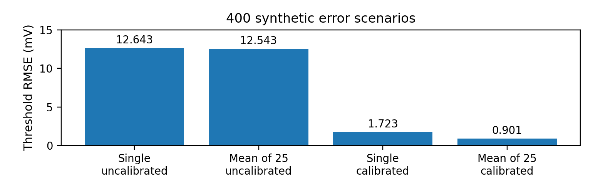
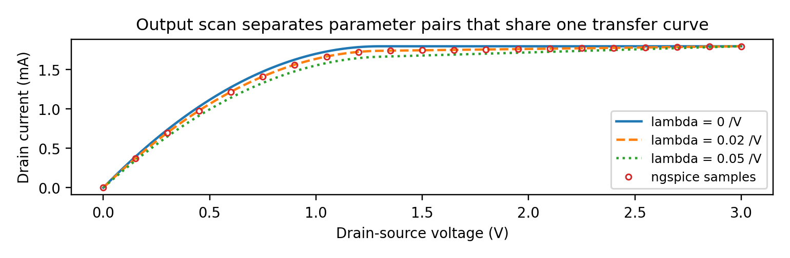

# MOSFET Characterisation with MATLAB & ngspice

**Simulation-based device modelling, parameter extraction and measurement-error analysis.**

[中文说明](README_CN.md) · [Detailed results](docs/RESULTS.md) · [MATLAB quick start](#run-the-project)

A reproducible study of how MOSFET current–voltage curves are generated, how readout errors affect threshold extraction, and what measurements are needed to identify model parameters. The workflow combines an educational DC MOSFET model in MATLAB with executed ngspice sweeps, archived raw data and separate Python numerical checks.

**Project scope:** all data are simulated or synthetic. The results demonstrate modelling and analysis methods; no physical device measurements are included.

## Highlights

| Work | Result |
|---|---|
| Synthetic readout-error study | 400 paired scenarios; threshold RMSE fell from **12.543 mV** with uncalibrated averaging to **0.901 mV** with calibration and averaging |
| MATLAB–ngspice comparison | **8 DC curves / 1,078 records** satisfied the original comparison tolerances |
| Parameter extraction | Recovered the known model values of **Vth ≈ 1.200 V**, **β ≈ 0.002000 A/V²** and **λ ≈ 0.02000 V⁻¹** |
| Held-out prediction | **107 unique fitting bias points** and **959 unique held-out bias points**, with no overlap |
| Parameter identifiability | Demonstrated why one fixed-drain transfer curve cannot separately determine β and λ, and how an output sweep adds the missing information |

### Averaging and calibration solve different problems



Repeated readings reduce random variation, while calibration estimates systematic gain and offset errors. Calibration with 25-reading averages improved aggregate RMSE under the chosen assumptions, but **15 of 400 scenarios had larger absolute threshold error after calibration**. Those results remain in the dataset.

### An extra sweep can reveal more than denser sampling



In the saturation model, a transfer sweep at fixed VDS constrains the combination **β(1 + λVDS)**. Different β/λ pairs can therefore produce the same transfer curve. Sweeping VDS supplies additional information that separates the candidates.

## Three-stage workflow

| Stage | Method | Entry point |
|---|---|---|
| 1 — Synthetic measurement chain | Gain, offset, noise and quantisation; two-point calibration; paired Monte Carlo comparison | [`PSI_MOSFET_Stage1.m`](project/stage1/PSI_MOSFET_Stage1.m) |
| 2 — Mechanisms and SPICE | Isolated error sources; an incorrect fitting-region counterexample; automated ngspice sweeps and data comparison | [`RUN_STAGE2B.m`](project/stage2/RUN_STAGE2B.m) |
| 3 — Parameter identification | Square-root transfer fit, saturation output fit, duplicate-aware data partition and held-out prediction | [`RUN_STAGE3.m`](project/stage3/RUN_STAGE3.m) |

The repository retains raw `.dat` files, CSV tables, MATLAB results, figures, configuration, execution logs and the executed source snapshots. See [the result record](docs/RESULTS.md) for exact values and run locations.

## Run the project

The archived successful runs used **MATLAB R2024a** and **ngspice 47**. The code uses base MATLAB; compatibility with other MATLAB versions has not been established here. Obtain ngspice separately from its [official download page](https://ngspice.sourceforge.io/download.html).

**Quick start: reproduce Stage 3 from the bundled successful SPICE run.** In MATLAB, set Current Folder to `project/stage3`, then run:

```matlab
RUN_STAGE3
```

This reads the committed `data/` snapshot and generates a new `outputs_stage3/` directory and result ZIP. It does **not** invoke ngspice or automatically consume the latest Stage 2 output.

To run the earlier stages, change Current Folder before each command:

```matlab
% Current Folder: project/stage1
PSI_MOSFET_Stage1

% Current Folder: project/stage2
RUN_STAGE2B
```

Stage 2B prompts for the installed ngspice executable; on Windows, select `ngspice_con.exe` inside the full extracted distribution. Cancelling stops the launcher. Calling `PSI_MOSFET_Stage2` without an engine performs only Stage 2A, so use `RUN_STAGE2B` for the complete comparison.

### Recheck the archived numerical results with Python

From the repository root, with Python 3.10 or newer:

```sh
python -m pip install -r requirements.txt
python verification/audit_stage2b.py evidence/stage2/20260920_165426 local_audit_stage2
python verification/audit_stage3.py --run evidence/stage3/20260920_172044 --out local_audit_stage3
```

The public-data audits pass **63/63** and **21/21** checks respectively. They recompute the saved results; they do not execute MATLAB or ngspice. The archived MATLAB runs report Stage 1 **12/12**, Stage 2A **9/9**, and Stage 3 **13/13** self-checks.

## Interpretation

The MATLAB and SPICE comparisons share an educational MOS1 model. Their picoampere-scale residuals describe numerical consistency, **not instrument accuracy**. Fitting windows use known model information; the held-out points come from the same model. The project does not establish real-device validity, measurement traceability or robustness to model mismatch. Stage 1's threshold-error study also does not establish uncertainty for noisy three-parameter extraction.

## Repository guide

| Directory | Contents |
|---|---|
| [`project/`](project/) | Runnable MATLAB code, SPICE netlist, restored reference inputs and bundled Stage 3 data |
| [`evidence/`](evidence/) | Archived successful runs and executed source snapshots |
| [`verification/`](verification/) | Python audits and results from rechecking the public dataset |
| [`summary_figures/`](summary_figures/) | Presentation figures derived from the archived CSVs |
| [`docs/RESULTS.md`](docs/RESULTS.md) | Exact metrics, equations and evidence links |
